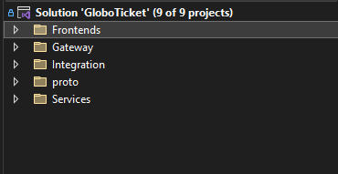
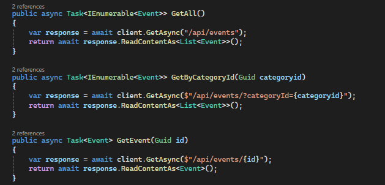
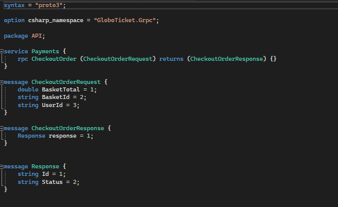
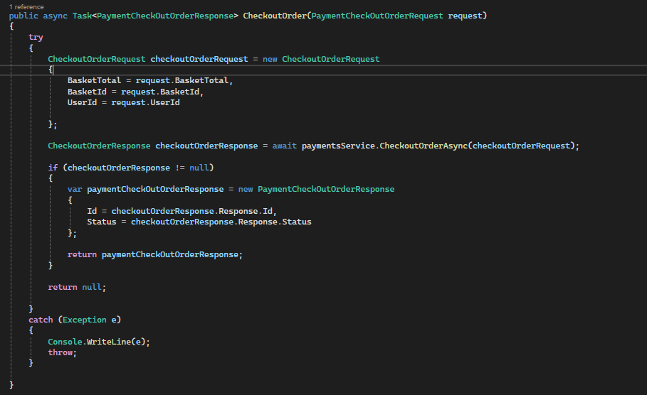
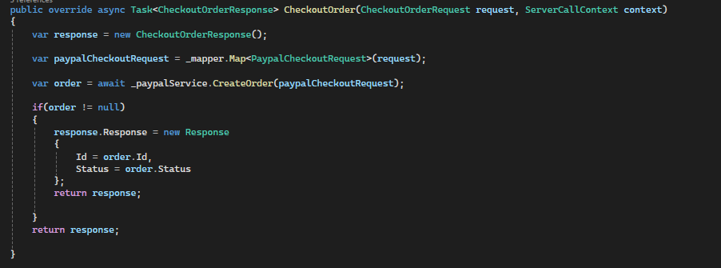
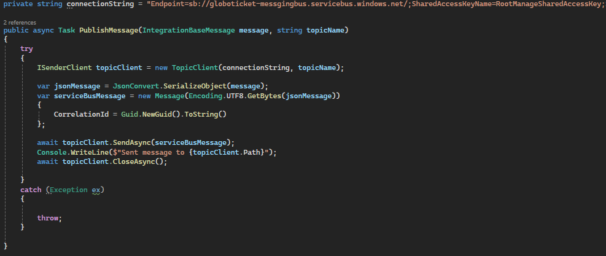
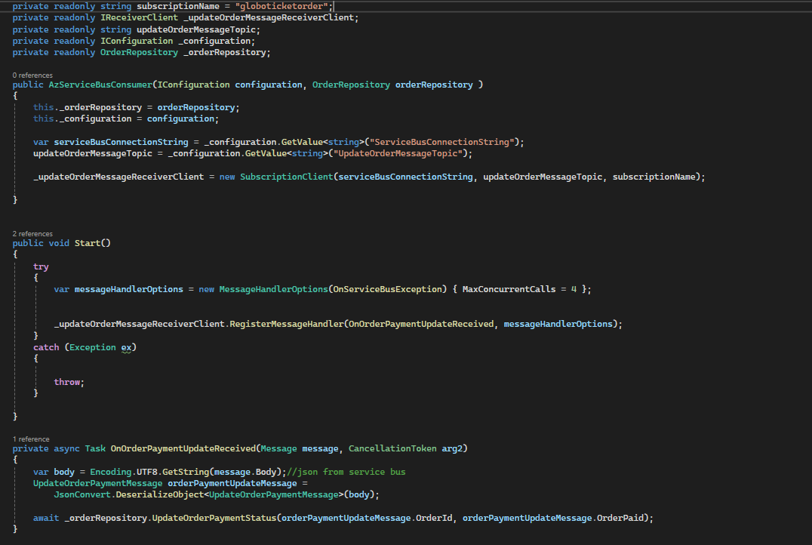
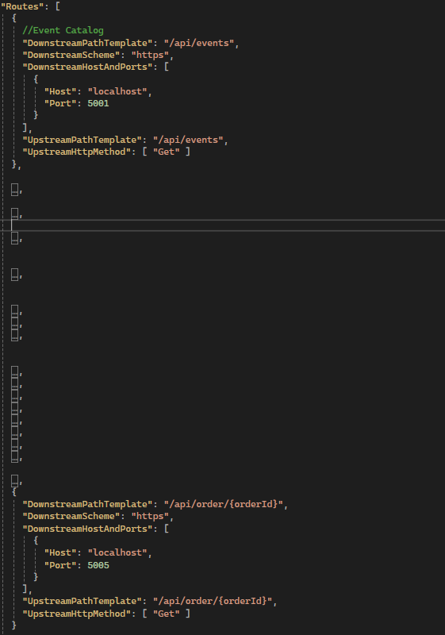
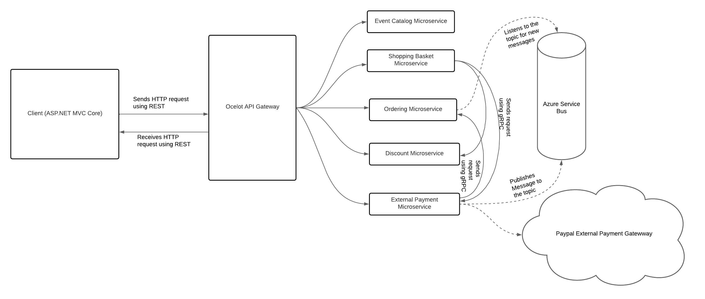

In order to explicitly understand the Microservices Architecture and also the communication between client-service and microservice-microservice, a mini-pet project called GloboTicket was built to demonstrate this. This project is an adaptation of a Pluralsight Course but not completely the same as the course as some part of the user flow differs. I will start by describing the architecture of the codebase.

**Folder Structure**

The codebase is is composed of a whole Solution which consist of 9 different projects, and these projects are housed in their respective folders. 

Frontends: This consist of the client application which in this case an ASP.NET MVC Core project (GloboTicket.Web) which sends HTTP requests to the Microservices.

Gateway: this folder houses the API gateway project (Ocelot.APIGateway) which s simply the extra layer between the clients and the microservices). This layer serves as a routing layer which handles all requests coming from the clients before redirecting them to their respective microservices for processing. The API gateway was built using Ocelot.

Proto: this folder simply contains the protobuff contracts used solely for synchronous communication between two microservices with the aid of gRPC.

Integration: this folder contains class library files that are responsible for carrying out Publish-Subscribe asynchronous communication between microservices.

Services: This folder houses all the different microservices. There are five (5) microservices namely;

- GloboTicket.Services.Discount
- GloboTicket.Services.EventCatalog
- GloboTicket.Services.ExternalPayment
- GloboTicket.Services.Ordering
- GloboTicket.Services.ShoppingBasket

**Synchronous Communication (gRPC and REST)**
In the course of this project, Two synchronous communication methods were adopted and they include gRPC and REST and they were used distinctively for different purposes. REST was used for all communications between the client and the servers (microservices) whereby HTTP requests are sent to the individual microservices while gRPC was solely used for communication between the microservices where needed.

**Client-Service Communication using REST**

Snippet of code using HTTP Client to make RESTful API calls to different microservice endpoints.

**Service-Service Communication using gRPC**
To implement gRPC, two parties has to be involved and one is defined as a gRPC client and the other as gRPC server. The microservice sending request is defined as gRPC client and the microservice receiving the request is defined as the gRPC server by adding it as a connected service using the defined protobuff contract.

snippet of a protobuff contract.

snippet of the implementation of contract extension on the gRPC client-side.

snippet of the implementation of the gRPC server.

**Asynchronous Communication (Publish-Subscribe Mechanism using Azure Service Bus)**

This is the implementation in the Messaging that publishes messages to the "Topic" on Azure.

This Implementation is the Azure Service Bus consumer which listens to the topic for any message.

**API Gateway**
The API gateway was built using Ocelot. This Gateway handles all routing from the client to downstream APIs.

**Architecture**

